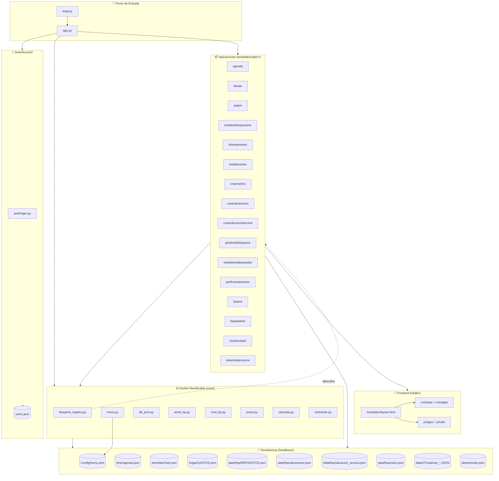
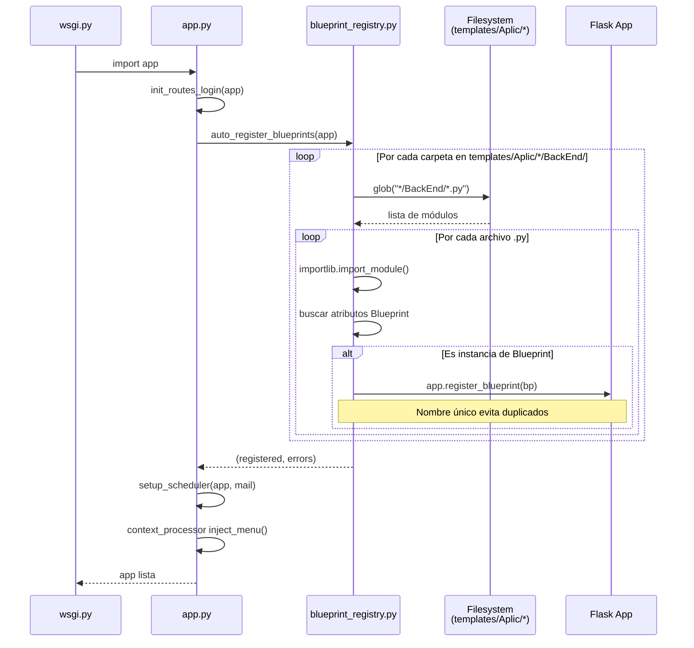
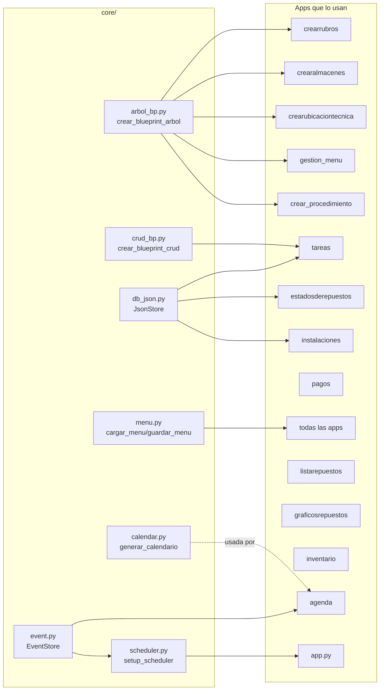
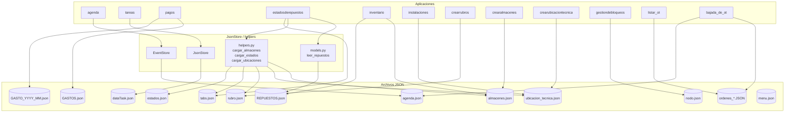
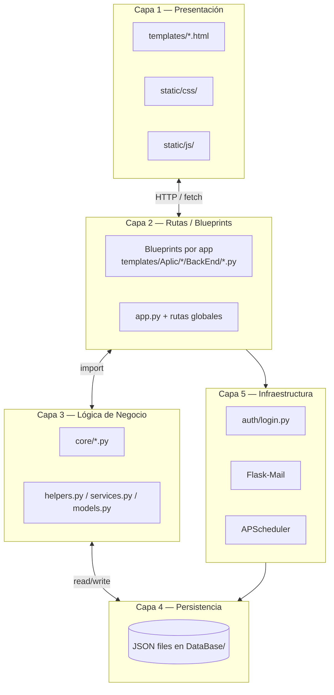

# 🏗️ Diagramas de Arquitectura - Sistema Empresa

> Fecha: 2026-09-05
> Herramienta de renderizado recomendada: [mermaid.live](https://mermaid.live)

---

## 1️⃣ Arquitectura General del Sistema

Visión global de cómo se conectan los componentes principales.



**Leyenda de conexiones:**
- `──▶` dependencia directa / import
- `-.─▶` relación indirecta / descubrimiento dinámico

---

## 2️⃣ Flujo de Auto-Registro de Blueprints

Cómo el sistema descubre y registra automáticamente cada aplicación nueva **sin tocar `app.py`**.



**Ventaja clave:** agregar una app nueva = solo crear la carpeta, **cero cambios en `app.py`**.

---

## 3️⃣ Módulos Core y sus Consumidores

Qué aplicaciones usan cada módulo reutilizable de `core/`.



---

## 4️⃣ Flujo de Autenticación y Autorización

Cómo se valida el acceso a las rutas protegidas.

```mermaid
flowchart TB
    U[Usuario] -->|GET /login| LG[login()]
    U -->|POST credenciales| LG
    U -->|POST rostro| LGF[login_rostro()]

    LG -->|valida| UD[users.json]
    LGF -->|compara| CV[comparar_rostros<br/>OpenCV]
    CV -->|lee| IMG[static/rostros/*.png]

    LG -->|éxito| LU[login_user]
    LGF -->|éxito| LU
    LU -->|crea| SE[Session Cookie]
    SE -->|redirige| IX[index /]

    subgraph PROTECCION["En cada ruta protegida"]
        LR2[@login_required]
        RR[@roles_required]
        CM[cargar_menu]
        CP[context_processor<br/>inject_menu]
    end

    IX --> LR2
    LR2 -->|valida sesión| RR
    RR -->|valida rol| RR2[Handler de la app]
    RR2 --> CM

    CP -.inyecta.-> TPL[layout.html]
    CM -.renderiza.-> TPL

    LG -->|fallo| FL[flash error]
    LGF -->|fallo| FL
```

**Roles del sistema:** `admin`, `editor`, `viewer`

---

## 5️⃣ Flujo de Datos (JSON Stores)

Cómo las aplicaciones leen y escriben datos persistentes.



---

## 6️⃣ Frontend: Módulos JS y su Relación con Backend

Cómo los scripts JS consumen las APIs Flask.

```mermaid
flowchart TB
    subgraph JSUTIL["js/utils/ (reutilizables)"]
        JU1[selectores_nivel.js<br/>SelectoresNivel]
        JU2[calendar.js<br/>Calendar]
        JU3[event_modal.js<br/>EventModal]
        JU4[notificaciones.js]
    end

    subgraph JSAPPS["js/apps/ (específicos)"]
        JA1[arbol_crud.js<br/>ArbolCRUD]
        JA2[logger.js<br/>Logger]
        JA3[image_uploader.js<br/>ImageUploader]
        JA4[layout_scripts.js]
        JA5[modal_animations.js]
        JA6[pagos.js / newPagos.js]
        JA7[tareas.js]
        JA8[agenda.js / evento.js]
        JA9[instalaciones.js]
        JA10[repuestoForm.js<br/>repuestoEvents.js<br/>repuestoUtils.js]
    end

    subgraph APIs["APIs Flask"]
        API1[/api/rubro_arbol<br/>/api/rubro]
        API2[/api/ubicacion_arbol<br/>/api/ubicacion]
        API3[/api/crear_almacenes_arbol<br/>/api/crear_almacenes]
        API4[/api/tareas]
        API5[/agenda/eventos]
        API6[/pagos/*]
        API7[/api/repuestos]
        API8[/api/ubicaciones<br/>/api/editar_ubicacion]
        API9[/api/subir_imagen]
    end

    subgraph LIBS["Librerías CDN"]
        L1[Bootstrap 5]
        L2[Select2]
        L3[SweetAlert2]
        L4[Noty]
        L5[ECharts]
        L6[MediaPipe]
    end

    JA1 --> API1
    JA1 --> API2
    JA1 --> API3
    JA1 --> L3
    JA1 --> L4

    JU1 --> API1
    JA6 --> JU1
    JA6 --> API6

    JA7 --> API4
    JA7 --> JA2
    JA7 --> L3
    JA7 --> L4

    JA8 --> API5
    JA8 --> JU2
    JA8 --> JU3

    JA9 --> API8
    JA9 --> API9
    JA9 --> JA3
    JA9 --> JA2

    JA10 --> API7
    JA10 --> L2

    JA4 --> L1
    JA5 --> L1
```

---

## 7️⃣ Diagrama de Caperas (resumen ejecutivo)



---

## 📌 Resumen de Conexiones Clave

| Módulo | Conecta con | Propósito |
|---|---|---|
| `app.py` | `auth/`, `core/`, `templates/Aplic/` | Orquestador principal |
| `blueprint_registry.py` | `templates/Aplic/*/BackEnd/*.py` | Auto-descubrimiento |
| `arbol_bp.py` | 5 apps (rubros, almacenes, ubicaciones, menú, procedimiento) | CRUD jerárquico genérico |
| `db_json.py` | 8+ apps | Persistencia JSON con ID autoincremental |
| `event.py` | agenda, scheduler | Gestión de eventos con recordatorios |
| `menu.py` | TODAS las apps | Menú de navegación global |
| `auth/login.py` | TODAS las rutas `@login_required` | Sesiones + roles + facial |
| `ArbolCRUD` (JS) | `arbol_bp.py` (backend) | Frontend del CRUD jerárquico |
| `SelectoresNivel` (JS) | APIs de árbol | Selectores multinivel reutilizables |
| `ImageUploader` (JS) | `/api/subir_imagen` | Subida de imágenes con drag&drop |
| `Logger` (JS) | Todos los módulos JS | Logs profesionales con colores |